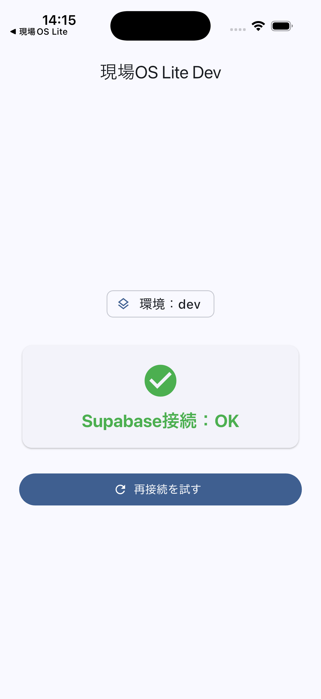
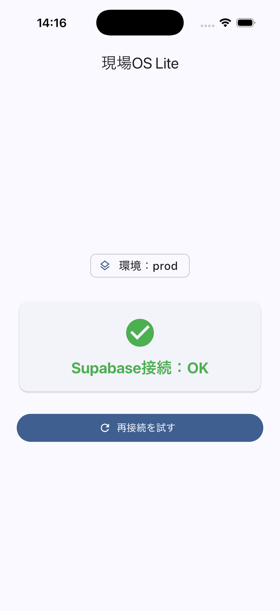

# Phase 1.0 完了報告書 — 現場OS Lite

**作成日:** 2026年6月21日　／　**対象:** Phase 1.0（基盤構築）　／　**ステータス:** ✅ 完了

---

## 1. プロジェクト概要

| 項目 | 内容 |
|---|---|
| プロダクト | 現場OS Lite（仮称） |
| 対象顧客 | 中小建設企業（現場で働く職人・監督） |
| 開発目的 | 建設現場の業務をスマホで支援するアプリ。全10フェーズの開発ロードマップの土台（基盤）から構築する。 |
| プラットフォーム | iOS / Android（モバイル中心。Web は当面対象外） |
| バックエンド | Supabase（dev / prod の2環境） |

---

## 2. Phase 1.0 の目標

Phase 1.0 は「機能」ではなく、以降のすべての機能が乗る **土台（基盤）** を作ることを目標とした。

- **基盤構築** — アプリの起動処理・設定・画面骨格の整備
- **dev / prod 環境分離** — 開発用と本番用で接続先・アプリを完全に分ける
- **CI 構築** — コードを保存するたびに自動で品質チェックが走る仕組み
- **Git 管理** — ソースコードを GitHub で安全に管理
- **Flutter 基盤構築** — feature-first アーキテクチャ・状態管理・ルーティングの確立

---

## 3. 完了内容

### 3-1. 技術構成

| 区分 | 技術 | バージョン | 役割 |
|---|---|---|---|
| フレームワーク | Flutter | 3.44.2 | iOS / Android を単一コードで開発 |
| バックエンド | Supabase（supabase_flutter） | ^2.15.0 | DB・認証・APIキー（dev/prod 2環境） |
| 状態管理 | Riverpod（flutter_riverpod） | ^3.3.2 | アプリ状態のオーケストレーション |
| ルーティング | GoRouter（go_router） | ^17.3.0 | 画面遷移・認証リダイレクト |
| モデル生成 | Freezed | ^3.2.5 | イミュータブルなデータモデル生成 |
| CI/CD | GitHub Actions | — | push/PR ごとの自動 analyze + test |

### 3-2. 実施内容

| # | 実施項目 | 内容 |
|---|---|---|
| 1 | Supabase dev/prod 構築 | 開発用・本番用の2プロジェクトを作成し、接続URL・公開鍵を取得 |
| 2 | 環境変数管理 | `.env.dev` / `.env.prod` で接続情報を分離。Git管理外とし、`.env.example` のみ追跡 |
| 3 | feature-first 構成 | `core / shared / features` の3層。依存方向は presentation → application → data の一方向 |
| 4 | CI 構築 | GitHub Actions で analyze + test を自動実行（実鍵不要・接続テストなし） |
| 5 | テスト構築 | ユニット/ウィジェットテスト 6件 |
| 6 | iOS 起動確認 | iOSシミュレータ（iPhone 17 Pro）で起動し「接続OK」を目視確認 |
| 7 | Flavor 対応 | iOS Build Configuration 9種・Android productFlavor を整備し dev/prod を分離 |
| 8 | Scheme 対応 | 共有Scheme `dev` / `prod` を作成し、各ビルドアクションに対応Configを割当 |

---

## 4. 成果

| 成果項目 | 判定 | 証拠 |
|---|---|---|
| dev 起動成功 | ✅ | `flutter run --flavor dev` → Xcode build done / Dart VM Service 起動 |
| prod 起動成功 | ✅ | `flutter run --flavor prod` → 同上 |
| Supabase 接続成功 | ✅ | dev・prod とも画面に「Supabase接続：OK」を表示（接続先は別プロジェクト） |
| analyze 成功 | ✅ | `flutter analyze` → **No issues found!** |
| test 成功 | ✅ | `flutter test` → **All tests passed!**（6件） |
| GitHub 管理完了 | ✅ | `main` に push 済み・CI success・作業ツリー差分なし |

> dev と prod は Bundle ID が異なる（dev=`com.example.genbaOsLite.dev` / prod=`com.example.genbaOsLite`）ため、
> 1台の端末に同居インストール可能。接続先 Supabase も別プロジェクト（URL・anon key とも相違を確認済み）。

---

## 5. 変更ファイル一覧（コミット履歴ベース）

### コミット履歴

| # | ハッシュ | 日付 | 内容 |
|---|---|---|---|
| 1 | `c4d5469` | 2026-06-19 | Initial Flutter setup |
| 2 | `74e5c0d` | 2026-06-19 | Add Phase1 specification |
| 3 | `55f9a8a` | 2026-06-21 | Phase 1.0: 基盤構築 |
| 4 | `90ffa6c` | 2026-06-21 | docs: ROADMAPを実態に同期 |
| 5 | `8a5f276` | 2026-06-21 | ci: Androidビルドを後回し方針に合わせCIから除外 |
| 6 | `9a957b6` | 2026-06-21 | docs: チーム共有用の進捗報告書PDFを追加 |
| 7 | `f208e27` | 2026-06-21 | Phase 1.0完了: iOS Flavor正式対応（dev/prod） |

### 変更規模（スキャフォールド `c4d5469` 以降）

**52 ファイル変更 / +4,825 行 / −172 行**

| カテゴリ | ファイル数 | 主なファイル |
|---|---|---|
| lib/（Dartコード） | 17 | `bootstrap.dart` `app.dart` `core/config/*` `core/supabase/*` `features/foundation/*` |
| ios/（Flavor・Xcode設定） | 12 | `Runner.xcodeproj/project.pbxproj` `xcschemes/{dev,prod}.xcscheme` `Flutter/*-{dev,prod}.xcconfig` |
| 設定（pubspec等） | 3 | `pubspec.yaml` `pubspec.lock` `analysis_options.yaml` |
| docs/（ドキュメント） | 3 | `ROADMAP.md` `SETUP.md` 進捗報告PDF |
| .github/（CI） | 1 | `workflows/ci.yml` |
| test/（テスト） | 1 | `widget_test.dart` |

---

## 6. スクリーンショット（接続OK画面）

| dev 環境 | prod 環境 |
|---|---|
|  |  |
| 現場OS Lite Dev ／ 環境：dev ／ Supabase接続：OK | 現場OS Lite ／ 環境：prod ／ Supabase接続：OK |

---

## 7. 学び・課題

- **Xcode Flavor 構成**: Flutter の iOS flavor は「`Debug-<flavor>` 等の Build Configuration」＋「flavor 名と一致する Scheme」が必須。
  今回は Build Configuration を9種（基本3 × dev/prod の6）整備し、各 flavor に専用 xcconfig を紐付け、ターゲットの Bundle ID 直書きを削除して
  xcconfig 側の値（`.dev` サフィックス）が効くようにした。手作業の Xcode GUI ではなく `xcodeproj` で自動化し、再現性と安全性を確保した。
- **Scheme 管理**: 共有Scheme（Shared）にしないと CI や他環境から見えないため、`dev` / `prod` を Shared で作成。
  Scheme 名は `--flavor` の値と完全一致（大文字小文字含む）させる必要がある。
- **SPM 採用（CocoaPods 不採用）の理由**: 本 Flutter 構成では iOS プラグイン解決に **Swift Package Manager (SPM)** が使われ、`Podfile` が生成されなかった。
  当初のセットアップ手順は CocoaPods 前提だったが不要と判明。SPM は依存解決が速く、`Podfile` / `Pods/` の管理が不要という利点がある。
  flavor xcconfig 側も `#include?`（条件付きインクルード）で Pods を参照しているため、Pods 不在でも安全に動作する。

---

## 8. Phase 1.1 計画（次フェーズ）

**テーマ: 認証 / ログイン**

| 項目 | 内容 |
|---|---|
| companies | 会社（テナント）テーブル。マルチテナントの起点 |
| profiles | ユーザープロフィール。会社に紐付く |
| RLS | Row Level Security。`company_id` ＋ `current_company_id()` で自社データのみアクセス可に |
| Auth | Supabase Auth によるログイン画面。go_router で認証ガード（未ログインは `/login`、ログイン後は現場一覧へ） |

---

## 9. KPI

| 指標 | 値 |
|---|---|
| Phase 1.0 進捗率 | **100%**（完了） |
| 全体ロードマップ進捗率（Phase 1〜10） | **約10%**（推定） |

```
Phase 1.0 ████████████████████ 100%  ✅ 完了
全体      ██░░░░░░░░░░░░░░░░░░░  ~10%
```

---

*本報告書は現場OS Lite リポジトリ `docs/reports/` 配下で管理されています。*
